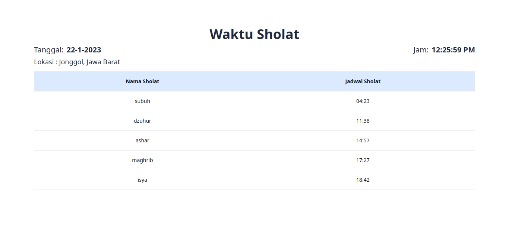

# Website mesjidku

Website mesjidku ini adalah sebuah website yang di buat untuk melihat jadwal sholat khusus nya untuk daerah Kabupaten Bogor.

## Tech stack
1. React
2. TailwindCSS
3. Public API dari [API MYQURAN.com](https://documenter.getpostman.com/view/841292/Tz5p7yHS)

## Cara Penggunaan
1. Clone repository ini
2. Buka folder yang sudah di clone
3. yarn install | npm install
4. yarn start | npm start
5. Buka browser dan ketikkan localhost:5173

## Cara Kontribusi
1. Fork repository ini
2. Clone repository yang sudah di fork
3. Buka folder yang sudah di clone
4. yarn install | npm install
5. yarn start | npm start
6. Buka browser dan ketikkan localhost:5173
7. Buat branch baru
8. Buat perubahan yang di inginkan
9. Commit perubahan yang di inginkan
10. Push perubahan yang di inginkan
11. Buat pull request

## TodoList Fitur
- [ ] Menampilkan jadwal sholat berdasarkan kota yang di inputkan
- [ ] Menampilkan jadwal sholat berdasarkan lokasi yang di dapatkan dari browser
- [ ] Membuat fitur pencarian kota
- [ ] Membuat fitur akan bersuara ketika waktu sholat
- [ ] Update UI biar lebih modern dan mudah di baca user
- [ ] Membuat website ini menjadi PWA

